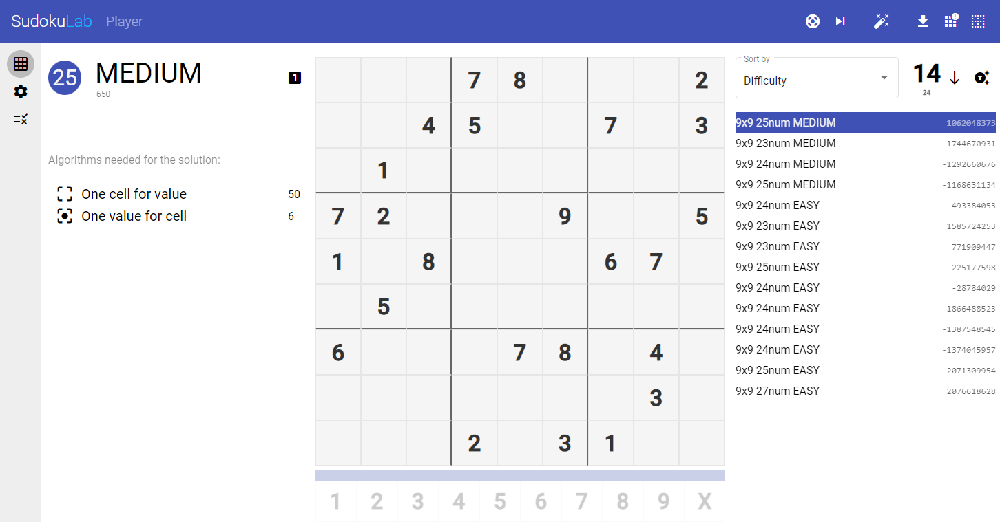

# Sudokulab

A place to test, play and generate sudoku puzzles.

## Player

Here you can play with all the generated schemas or upload your own.



## Generator

The generator allows you to create the patterns you want by specifying the number of values,
symmetry, bookmarks for random values, difficulty, and so on.


<br>

# On line

You can see the app online at:

[sudokulab.herokuapp.com](https://sudokulab.herokuapp.com/)


# local use:

build dependencies
````
$ npm install
````

run build script
````
$ npm run build
````

> **WARNING**: <br>app use a mongodb connection, so you have to specify a valid remote connection or install locally mongodb<br> [MongoDB Community Server](https://www.mongodb.com/try/download/community)

so run start script
````
$ npm start
````
