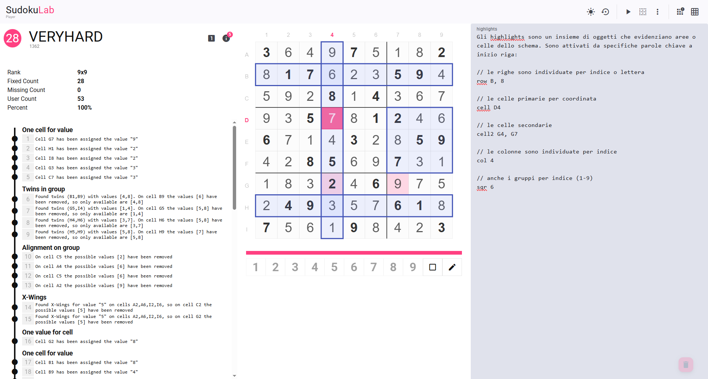
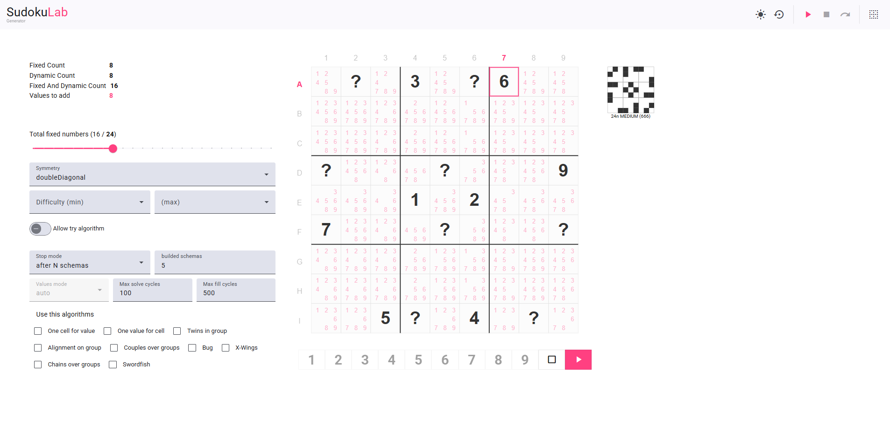
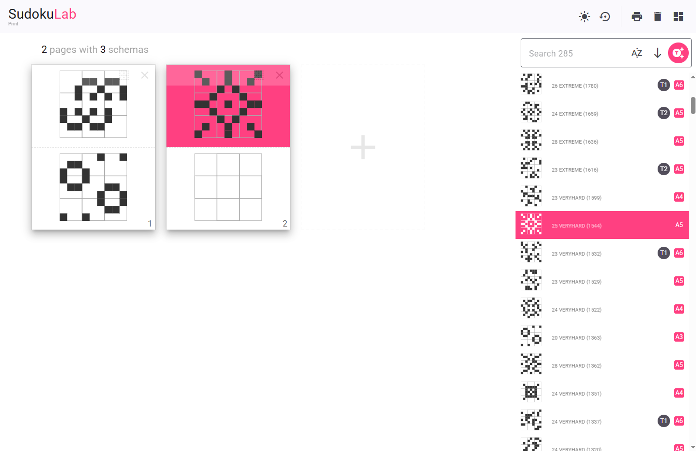

# SudokuLab

## Sudoku Lab to learn the techniques of solving or generate patterns with predefined geometries and maybe print them on paper.

### The Player

In the player you have the opportunity to learn to solve even very complex patterns.
The `step-viewer` allows you to explore step by step the resolution techniques with concrete examples on the patterns you solve.

  

### The Generator

On the generator page you can generate Sudoku puzzles by indicating:
- the number of fixed values you want;
- the level of difficulty;
- the symmetry of the values if you let the procedure add them for you;
- The use of certain algorithms chosen from the list of available ones;

a certain number (1-10) of autonomous processes will proceed by calculating the patterns and then producing them in the common area.  

  

### The Print Tool

Here you can produce documents with the patterns you find most interesting and solve them manually on paper.

  

Try it on [sudokulab.herokuapp.com](https://sudokulab.herokuapp.com)

> If you would like additional information contact me on [leo.olmi@gmaill.com](mailto:leo.olmi@gmaill.com)
