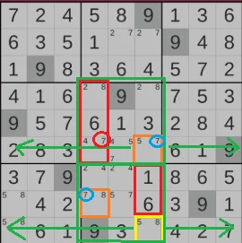

# Y-Wing

Quando si esegue la scansione per individuare gli Y-wing, è necessario mettere tutto da parte e pensare solo agli Y-wing. Eseguire la scansione da sinistra a destra, riga per riga, POI eseguire la scansione dall'alto verso il basso, colonna per colonna.

Il modo più semplice per cercarli se sei un principiante è quello di analizzare sempre le righe, poi le colonne quando cerchi le prime 2 coppie su 3, non analizzare le caselle finché non cerchi la terza coppia.

In questo caso specifico di questo puzzle, usa questo esempio:

Quindi, in questo caso, stiamo esaminando le colonne dall'alto verso il basso, da sinistra a destra. Ci imbattiamo in un 5/7 e vediamo che c'è un 5/8 nella stessa colonna. Questo è un segno diretto di quello che potrebbe essere un'ala a Y, perché 1 candidato si ripete, ed è una cella candidata 2. Prendi il candidato ripetuto 5) e rimuovilo, e usa le altre 2 cifre come cella che stai cercando, che ora è 7/8.

Ora, inizia la scansione per il terzo numero (7/8)

Poiché i 2 numeri che hai trovato si trovano nella stessa colonna, devi esaminare le RIGHE in cui sono stati trovati, estendendosi a sinistra o a destra, così come le CASELLE in cui sono stati trovati.

In questo caso, la casella centrale in basso contiene un 7/8. Ora hai trovato uno Y-Wing!

Il tuo pivot box diventa il box che vede entrambe le celle. In questo caso, il 5/8 vede entrambe le vendite tramite Colonna e box. È il tuo pivot sell.

Il candidato che puoi rimuovere è ora il numero che si ripete nelle 2 ali. Quel numero sarebbe 7

Ora sei pronto per iniziare a cercare candidati da rimuovere.

I candidati possono essere rimossi nelle celle che vedono ENTRAMBE le ali. Se entrambe le ali fossero esterne al riquadro del pivot, avresti solo 1 cella da cui rimuovere. Poiché una delle celle si trova all'interno dello stesso riquadro del pivot, puoi rimuovere da più caselle.

Ho disegnato un'immagine che mostra esattamente come funziona l'intero processo. All'inizio è molto lunga, ma mostra esattamente come cercare e da dove rimuovere.

Verde: Qui devi cercare la terza cella. Entrambe le caselle contengono le prime due celle che hai trovato, ed entrambe le righe, poiché queste due sono state trovate in una colonna.

Giallo: Cellula pivot. Vede entrambe le ali

Arancione: Cellule alari, entrambe vedono la cellula pivot, ma non l'una l'altra.

Blu: il numero ripetuto che indica quale candidato rimuovere.

Rosso: Area da cui è possibile rimuovere il candidato ricorrente. In questo caso, il candidato è il numero 7.
